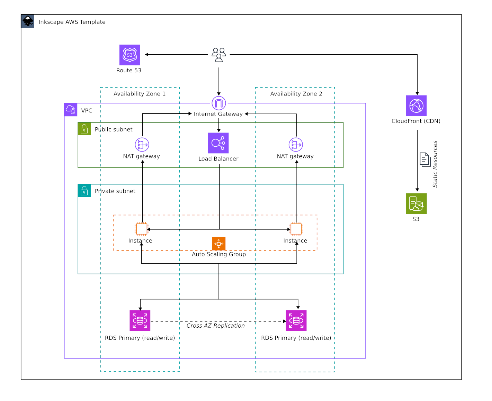

# Inkscape Cloud Architect

_We can do better than all that expensive online crap editors_ 😎

Make Inkscape a professional Cloud Visualization Studio for Cloud Architects.

## Includes

- AWS Symbol Sets
- AWS Diagram Templates




## Install (tested on linux only)

Clone repo.

Build symbols and install all symbols and templates in current users inkscape folder.

```
git clone https://github.com/mipmip/inkscape-cloud-architect
cd inkscape-cloud-architect
make all
```

## Remove

Remove all install assets:

```
make clean
```

## Usage

### Using templates

Click `New from template` in File menu and search for `AWS`.

### Using Symbols

Open the symbols tab and select an AWS panel. You can also select all symbols
and then search for specific AWS symbols. Eg. `NAT`.

### Inkscape tips for diagramming

Inkscape is a vector drawing application which can have many purposes. Read these [tips to optimize your Inkscape workflow](docs/tips.md) for creating Cloud Diagrams.

## Future

- Connect to AWS to visialize live cloud environments.
- Instance Types
- Azure
- Install scripts for macOS
- Install scripts for Windows

## Disclaimer

Icons are downloaded from AWS and AWS is copyright owner of these icons.

_sponsored by [TechNative](https://technative.eu)_
