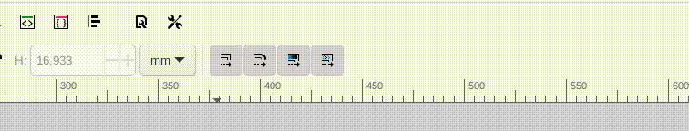
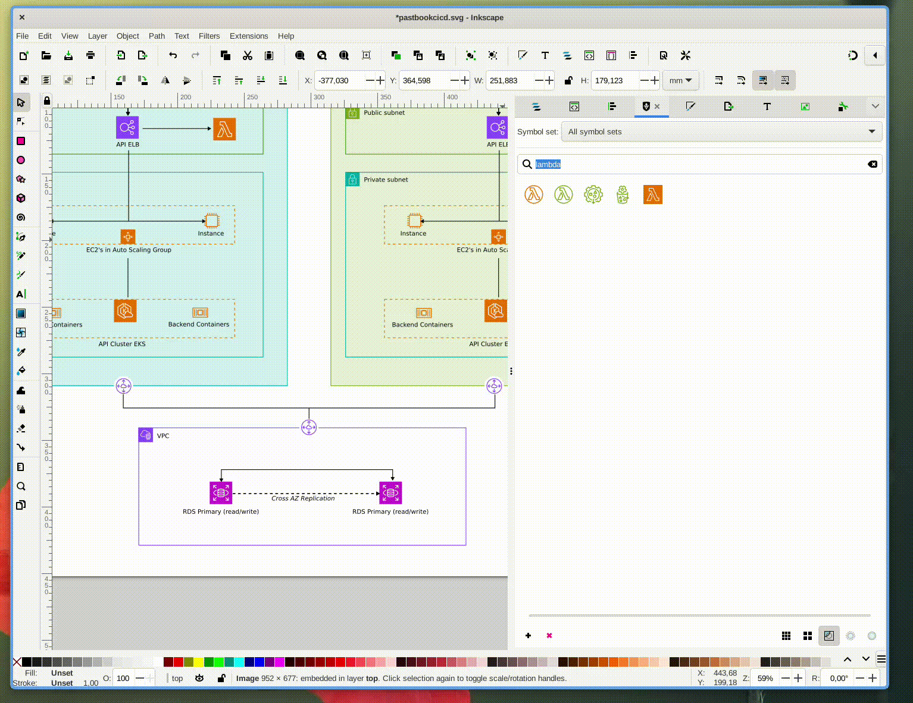

# Tips for making infrastructure diagrams in Inkscape.

### Learn some important hotkeys:

- <kbd>Esc</kbd> Deselect
- <kbd>S</kbd> Select object mode. E.g. for dragging or scaling subnets.
- <kbd>N</kbd> Select nodes mode. This is userful for manipulating lines with arrows.
- <kbd>B</kbd> Draw lines. Use this to draw lines and arrows.

### Disable Automatic Stroke width and corner radius

You don't want to border widths to scale when you change subnets etc...

 [(see webm video)](videos/turn-off-line-scaling.webm)

### Open the symbols tab as a seperate window

This safes you space. You can do this with other panels you often use. When
diagramming the `Fill and Stroke` and `Layer` panels our often used.

 [(see webm video)](videos/panel-as-window.webm)

### Inkscape has dark theme's

For all you vampires out there... Inkscape has dark mode themes.

### Lines with straigh corners and arrows

Use the `Draw lines` tools to create connection lines and arrow.

How is works:

1. click <kbd>B</kbd> to select the draw tool.

2. With you mouse do a short click at the starting point (can always be moved)

3. Keep the <kbd>CTRL</kbd>+<kbd>Shift</kbd> keys pressed while moving your mouse to the destination. The <kbd>CTRL</kbd>+<kbd>Shift</kbd> keys makes it easier to create 100% horizontal or 100 vertical lines.

5. At destination do another short click.

7. Repeat this with new nodes. When finished click <kbd>Enter</kbd>

8. Afterwards add arrow points in the `stroke style` panel.

[Webm video](videos/lines.webm) showing how to create a line with arrow.
